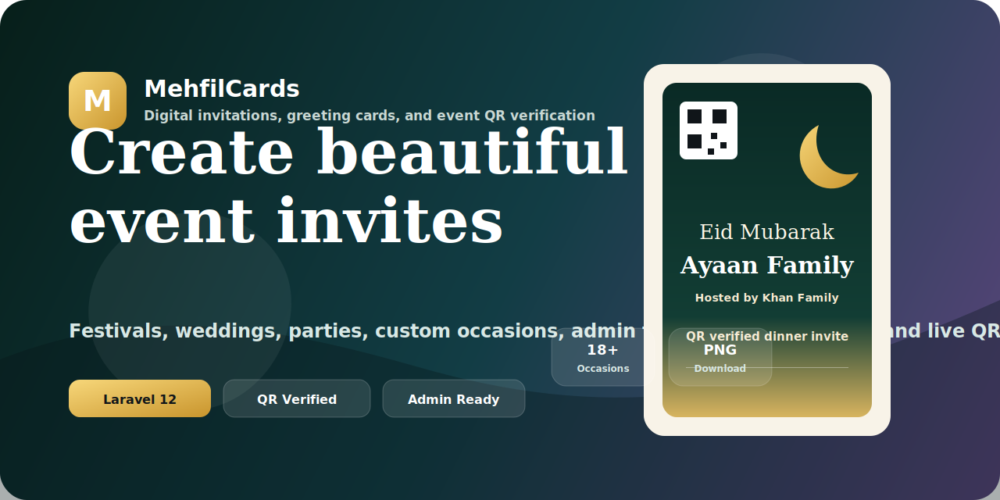

<p align="center">
  
</p>

<h1 align="center">MehfilCards</h1>

<p align="center">
  A premium Laravel platform for digital invitations, greeting cards, event QR verification, and admin-managed card templates.
</p>

<p align="center">
  
  
  
  
</p>

## Overview

MehfilCards is a client-ready digital invitation system built for festivals, weddings, parties, family functions, corporate events, and completely custom occasions. It combines a polished card creator, live canvas preview, server-side PNG generation, QR-based invite verification, contact capture, subscriptions, payments links, and an admin panel for managing categories and card templates.

The project is designed as a complete product experience rather than a simple landing page. Visitors can create cards, admins can add categories and templates, and every generated invitation can be verified through QR scan or manual invite code lookup.

## Features

- Multi-occasion invitation creator for Eid, Ramzan, Dawat, Walima, Shadi, Wedding, Party, Holi, Diwali, Christmas, New Year, Birthday, Corporate, Aqeeqah, and more.
- Custom occasion input for any event name, such as Nikah, Shop Opening, House Party, Reception, Naming Ceremony, or Office Party.
- Live card preview with selectable designs and real QR preview.
- Server-generated PNG card download.
- QR payload with invite code, event details, guest name, host name, venue, contact, and public invite link.
- QR scanner page with camera scanning and manual verification.
- Admin authentication, categories, and custom design upload.
- Public contact section with WhatsApp, email, and payment links.
- Working newsletter subscription form saved to the database.
- Day and night mode with saved browser preference.
- Mobile local-network helper for testing QR scans on a phone.

## Tech Stack

| Layer | Technology |
| --- | --- |
| Backend | Laravel 12, PHP 8.2+ |
| Database | MySQL / MariaDB |
| UI | Bootstrap 5, custom CSS |
| Interactivity | jQuery, HTML Canvas |
| QR | Endroid QR Code |
| Image Output | PHP GD server-side PNG rendering |

## Screens & Routes

| Route | Description |
| --- | --- |
| `/` | Public card creator, contact section, and newsletter form |
| `/login` | Admin login |
| `/register` | Admin registration |
| `/admin` | Category and template management |
| `/scanner` | QR scanner and manual invite verification |
| `/payments` | Payment and service contact details |
| `/demo` | Demo invitation |

## Admin Workflow

1. Log in or register as an admin.
2. Add event categories such as Nikah, Reception, Shop Opening, or Office Party.
3. Upload custom artwork or generate theme-based templates.
4. Return to the public creator and select the category/template.
5. Create the invitation and download the PNG card.
6. Verify guests with QR scan or invite code lookup.

## QR Verification

Each invitation QR includes structured invite data:

- Invite code
- Occasion
- Event name
- Guest name
- Host name
- Date and venue
- Contact number
- Public invitation link

This makes the QR useful even during local development, where a phone may not always be able to reach a computer-only localhost address.

## Prerequisites

Make sure these are installed before running the project:

| Tool | Version | Notes |
| --- | --- | --- |
| PHP | 8.2 or higher | With `gd`, `mbstring`, `pdo_mysql`, and `fileinfo` extensions enabled |
| Composer | 2.x | PHP dependency manager |
| Node.js | 18+ | For Vite asset build (`npm run dev` / `npm run build`) |
| MySQL / MariaDB | 8.0 / 10.4+ | Create an empty database named `mehfilcards_laravel` |

> On Windows the easiest way to get PHP + MySQL together is [XAMPP](https://www.apachefriends.org/) or [Laragon](https://laragon.org/). Install [Composer](https://getcomposer.org/) separately and reopen the terminal so `php` and `composer` are on your `PATH`.

## Quick Start

With the prerequisites in place, a single Composer script installs everything, builds assets, and runs migrations:

```bash
composer run setup
```

Then start the full dev environment (server + queue + logs + Vite) with:

```bash
composer run dev
```

## Local Setup

Prefer to run the steps manually? Install dependencies:

```bash
composer install
npm install
```

Create and configure the environment:

```bash
cp .env.example .env
php artisan key:generate
```

Example MySQL settings:

```env
DB_CONNECTION=mysql
DB_HOST=127.0.0.1
DB_PORT=3306
DB_DATABASE=mehfilcards_laravel
DB_USERNAME=root
DB_PASSWORD=
```

Run migrations and seeders:

```bash
php artisan migrate --seed
```

Start the local server:

```bash
php artisan serve --host=127.0.0.1 --port=8001
```

Open:

```text
http://127.0.0.1:8001
```

## Mobile QR Testing

For testing QR scans on a phone connected to the same Wi-Fi network:

```text
start-mobile-server.bat
```

Keep the server window open while testing. If Windows Firewall asks for permission, allow PHP on the private network.

## Useful Commands

```bash
php artisan test
php artisan migrate:fresh --seed
php artisan config:clear
php artisan route:clear
php artisan view:clear
```

## Project Structure

```text
app/Http/Controllers/InvitationController.php  Invitation, QR, admin, payment, and subscribe logic
resources/views/home.blade.php                 Public creator and contact page
resources/views/admin.blade.php                Admin dashboard
resources/views/scanner.blade.php              QR verification UI
resources/views/layouts/app.blade.php          Shared layout, navbar, footer, theme toggle
public/css/mehfilcards.css                     Full UI styling and day/night mode
public/js/mehfilcards.js                       Canvas preview and live QR preview
database/migrations/                           Database schema
docs/assets/mehfilcards-banner.svg             README banner artwork
```

## Contact

- WhatsApp: `+91 8009030734`
- Email: `rizwan.creativeswork@gmail.com`

## Author

Built by [Rizwan Khan](https://github.com/Rizwan-Khan-2002).

## License

This project is open for portfolio and client demonstration use. Add your preferred license before commercial distribution.
